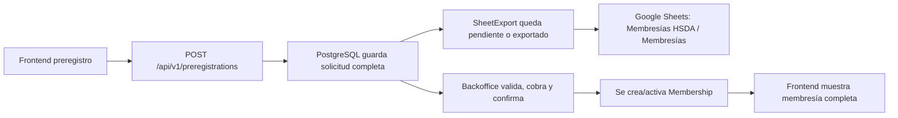

# Arquitectura Backend HSDA

## Principio rector

La fuente de verdad del sistema debe vivir en el backend y en PostgreSQL. Google Sheets queda como una proyección administrativa y visible para operación, nunca como repositorio principal de negocio.

## Insumos incorporados

Este diseño combina:

- El flujo de preregistro y activación ya construido en el frontend.
- El documento `FUNCIONES PARA APP (1).docx`, que define:
  - membresía individual, familiar y visualización grupal
  - tarjeta digital con folio, vigencia, nombre y QR
  - beneficios por plan
  - reglas de check-up para familiar
  - cashback, historial y QR de puntos
  - compra, renovación y registro de integrantes
  - contactos, términos y notificaciones
- La hoja `Membresías HSDA`, que solo necesita una extracción resumida de la operación.

## Dominios principales

### 1. Identidad y personas

- `Person`: representa a cualquier individuo registrado, titular o integrante.
- `UserAccount`: representa acceso autenticable a la app.
- `IdentityDocument`: conserva el documento oficial del titular.

Separar `Person` de `UserAccount` evita mezclar identidad real con acceso digital. Así un integrante puede existir en la membresía sin necesitar cuenta propia al inicio.

### 2. Catálogo comercial

- `MembershipPlan`: catálogo de planes, duración, cupo y check-ups.
- `BenefitCatalog`: catálogo de beneficios.
- `PlanBenefit`: asigna beneficios concretos por plan.
- `Product`: catálogo de productos o servicios que participan en descuentos o cashback.
- `PlanProductDiscount`: descuentos por tipo de plan y producto.

Esta capa permite cambiar beneficios sin tocar el historial de membresías activas.

### 3. Flujo comercial

- `MembershipApplication`: preregistro o solicitud formal.
- `ApplicationParticipant`: titular e integrantes que forman parte de la solicitud.
- `PaymentTransaction`: pagos asociados al preregistro o a la membresía.
- `Membership`: contrato vivo de la membresía después de aprobación.
- `MembershipParticipant`: personas adscritas a una membresía activa.

La solicitud y la membresía se separan para conservar historial. No toda solicitud termina en activación.

### 4. Activación, beneficios y vigencia

La activación administrativa no debe arrancar al crear el preregistro.

- `Membership.status`
- `Membership.activationStatus`
- `activatedAt`
- `expiresAt`

permiten reflejar exactamente la regla de negocio:

1. preregistro
2. validación
3. cobro
4. confirmación
5. activación real

Solo con activación:

- empieza la vigencia
- se habilita QR operativo
- empiezan check-ups y descuentos
- se habilita la experiencia completa de la membresía

### 5. Cashback y trazabilidad

- `CashbackAccount`
- `CashbackEntry`
- `AuditEvent`

Esto prepara el sistema para:

- acumulación de cashback
- redención futura
- exclusiones por tipo de servicio
- historial auditable de movimientos y cambios administrativos

### Regla de fase 1 para el QR

En la primera etapa, el QR de la membresía se usará solamente para acumular cashback.

Eso implica que el QR debe permitir:

- identificar la membresía activa
- registrar puntos o acumulaciones promocionales
- asociar el movimiento a la cuenta de cashback correspondiente

La redención del monedero como saldo a favor para pagar farmacia u otros conceptos queda prevista para una segunda fase, usando la misma base de `CashbackAccount` y `CashbackEntry`.

### 6. Proyección a Google Sheets

- `SheetExport`

Guarda:

- a qué documento se exportó
- a qué hoja
- payload resumido
- estado de exportación
- referencia externa o folio
- error si hubo fallo

## Flujo recomendado

## Endpoints iniciales

- `GET /api/v1/health`
- `POST /api/v1/preregistrations`

## Qué guarda PostgreSQL y qué va a Sheets

### PostgreSQL

Guarda el detalle completo:

- datos de titular e integrantes
- identidad
- notas
- flujo de aprobación
- pagos
- activación
- beneficios
- cashback
- productos y descuentos
- auditoría

### Google Sheets

Guarda solo la proyección administrativa:

- columnas operativas para control visual
- folio
- titular
- membresía
- estatus
- vigencia
- activación
- beneficios resumidos

## Próximos módulos naturales

1. autenticación y roles
2. activación administrativa y cobro
3. QR de membresía y cashback
4. renovación
5. redención del monedero como medio de pago
6. consumo de beneficios y check-ups
7. panel administrativo
